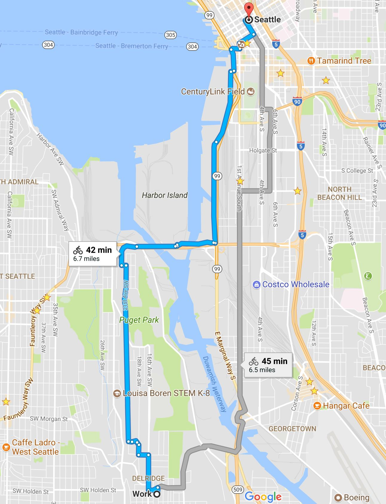
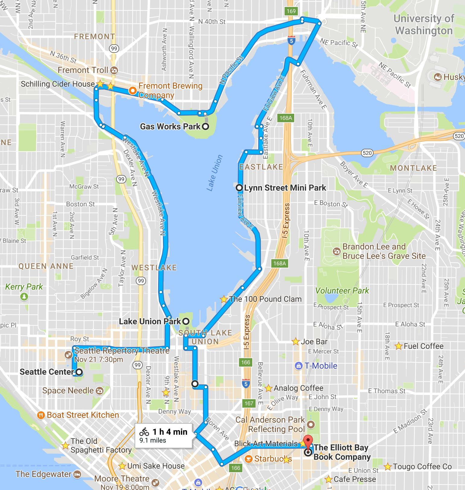
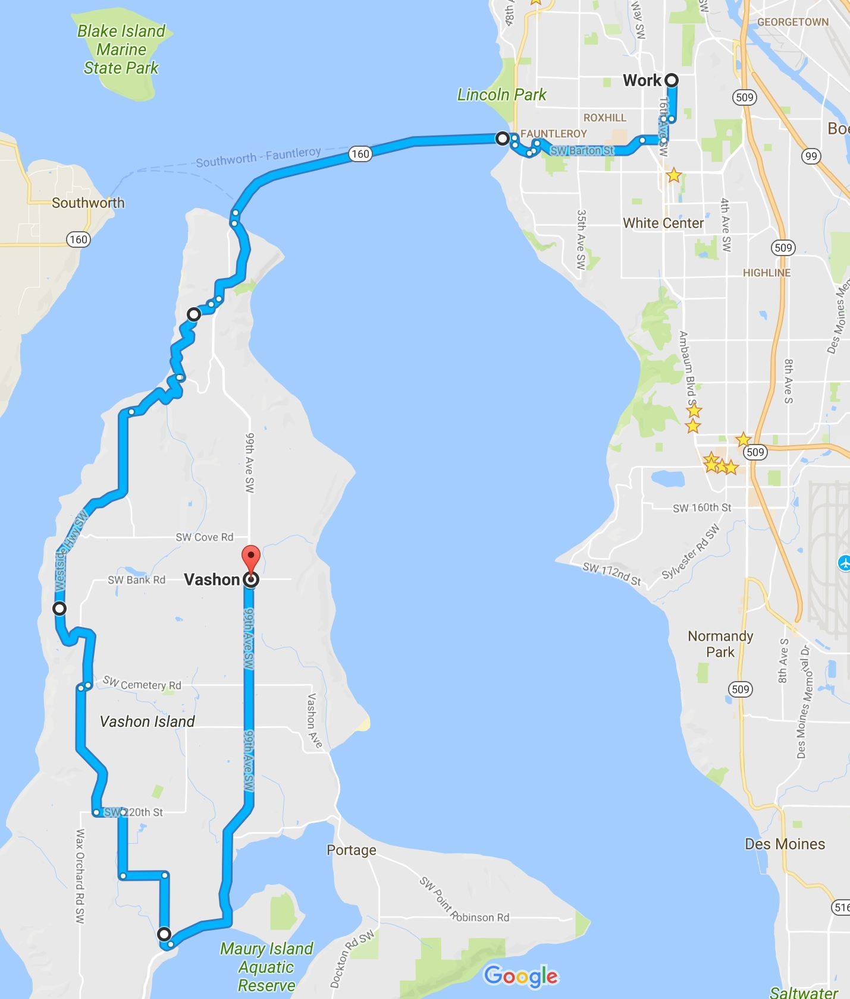

## Things to do in Seattle

### During the warm months (usually from beginning of May to end of October)

Seattle summers are simply incredible. Days are long and temperatures are pleasantly warm but it's rare for it to get too hot because summers are usually pretty dry.

- Go on a hike. There are lots of hikes, but you need a car and most good hikes are between 45 minutes to 3 hours away. The best way to find a good hike is to go check out [WTA (www.wta.org)](www.wta.org) where you can search for hikes and filter by location, length, difficulty and popularity. I myself try go hiking every week, so if I'm around let me know if you want to join me. 
  - For hikes not too far, I recommend **Little Sy** if you want something not too hard and **Big Sy** if you want something harder. **Mount Rainier** is about 3 hours away with traffic and it's beautiful. You pay about $20 to get into the park. Make sure to ask for a map. You then drive up to the big parking lot called **Paradise Inn** and choose one of the many trails there. 
  - **Mount St. Hellens** is about 3.5 hours away and much more challenging, but you need to purchase a climbing permit at [www.discovernw.org](www.discovernw.org). 
  - In the Olympic Peninsula I recommend checking out Crescent Lake and the nearby hikes. The easiest way to get to the Olympic Peninsula is by taking the **Fauntleroy-Southworth ferry** from West Seattle. It's about $20 for your vehicle and $5 per passenger to ride the ferry. On a beautiful day, riding the ferry itself is a fantastic experience.
- Ride your bike around town. The easiest way to rent bikes is using [LimeBike (www.limebike.com)](www.limebike.com), where you can rent bikes for cheap. You download an app and use it to unlock the bike and you can leave them anywhere. Seattle is very hilly, so the bike ride will give you a serious workout. The main roads usually have dedicated bike lanes.
  - To get to Downtown by bike, the easiest way is to head north on **Delridge**, then cross the bridge (follow the riders if you feel lost) on **SW Spokane Street** and follow **E Marginal Way S** to Downtown.

    

  
  - Biking around **Lake Union** is fun. In one day if you start early, you can cover the **Seattle Center** (where the Space Needle is), then head north on **Dexter Avenue** to **Fremont** and have a drink (the **Fremont Brewing Company** and **Shilling Cider House** are nice places for beer and cider, **Millstead** has good coffee) and something to eat (**Homegrown** is a great sandwich shop), then go to **Gas Works Park** and enjoy the view, then cross the bridge to head back South into **Eastlake** near the waterfront and from there head to **Capitol Hill** where there's a lot of restaurants and interesting shops (such as the **Elliott Bay Book Company** or **Ada's Technical Books and Cafe**).
  
    

  
  - Consider visiting **Vashon Island**. You take the **Fauntleroy-Southworth ferry** from West Seattle and get off on Vashon Island. There is a big uphill initially but once you get to the top the rest of the bike ride is not too bad. I recommend riding the back all the way back to Maury in the South of Vashon Island and then heading back North to Downtown Vashon, where you will find some good restaurants. Make sure to take enough water and food with you. There are lots of good parks and beaches on Vashon as well. On a beautiful day, the ferry ride alone is worth it. You pay about $5 per person and don't pay extra to get your bike on the ferry. The ferry back to Seattle from Vashon is free.

    

### Year-round

Cold is a relative term. If you're from California, Spain or Mexico, you'd say Seattle is cold during the Winter. If you're from Canada, northern Europe or the Northeast United States, then you'll just need a raincoat and a warm shirt underneath. If you need an umbrella let me know. It's true that Seattle is not the ideal winter getaway, but there's still things you can enjoy. 

- Check [Goldstar (https://www.goldstar.com)](https://www.goldstar.com) to find events that are going on in Seattle (or any major American city) and get discounts on tickets. You will need to sign up, use a credit card to pay and Goldstar will charge you a small commission (but offer discounts in return).
- Want to learn to paint Seattle landmarks? Visit [Brush Capades (http://www.brushcapadesseattle.com/)](http://www.brushcapadesseattle.com/).
- Like beer and ciders? In December you can go to the **Seattle Winter Brewfest**. The **Beer Junction** and **Beverage Place** in West Seattle and the **Fremont Brewing Company** and **Shilling Cider House** in Fremont.
- Consider a visit to the [The Kush Tour (https://kushtourism.com/tours/)](https://kushtourism.com/tours/) to learn about the Marijuana business. Nothing illegal.
- There are usually very good plays at the [ACT Theater (http://www.acttheatre.org/)](http://www.acttheatre.org/) downtown. There are lots of other theaters but ACT is my favorite. If you go on the night of the play just before it begins, tickets only cost $25 (last I checked) and there's almost always seats available.
- The [Seattle Center (http://www.seattlecenter.com/)](http://www.seattlecenter.com/) is where the Space Needle is has events going on year-round and their website is also a good place to find other events in all of Seattle.
- You might enjoy the [Seattle Underground Tour (http://www.undergroundtour.com/)](http://www.undergroundtour.com/) although it's a little cheesy (from what I heard).
