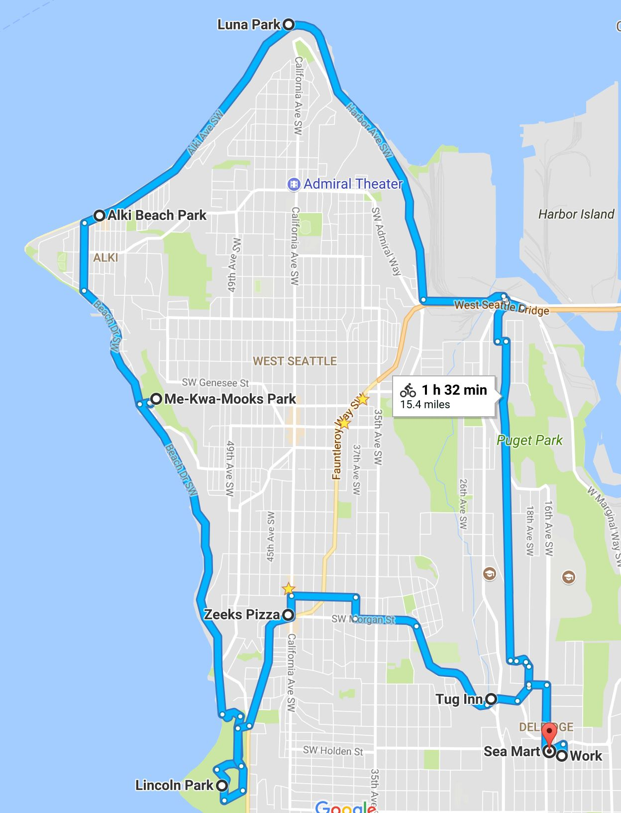

## Things to do in Seattle

Seattle summers are simply incredible. Days are long and temperatures are pleasantly warm but it's rare for it to get too hot because summers are usually pretty dry. During the winter months, Seattle can get cold, although cold is a relative term. If you're from California, Spain or Mexico, you'd probably say Seattle is cold during the Winter. If you're from Canada, northern Europe or the Northeast United States, then you're in luck, because usually all you need is a raincoat and a warm shirt underneath. It's true that Seattle is not the ideal winter getaway, but there are still plenty of things you can enjoy.

### See the city

- Go to [**Pike Place Market** (http://pikeplacemarket.org/)](http://pikeplacemarket.org/) and walk around. There are a lot of stores but here's what I recommend: Try the free samples of smoked salmon at one of the two fish markets, or both. You can also buy small servings of crab meat and other seafood (ever tried sea urchin?). Go to **Beecher's** to sample out the cheese and try their Mac and Cheese if you like that. Go to the original **Starbucks** store and wait in line forever to buy a cup of coffee. Make sure to check out the gum wall.
- Check [**Goldstar** (https://www.goldstar.com)](https://www.goldstar.com) to find events that are going on in Seattle (or any major American city) and get discounts on tickets. You will need to sign up, use a credit card to pay and Goldstar will charge you a small commission (but offer discounts in return).
- Want to learn to paint Seattle landmarks? Visit [Brush Capades (http://www.brushcapadesseattle.com/)](http://www.brushcapadesseattle.com/).
- Like beer and ciders? In December you can go to the **Seattle Winter Brewfest**. The **Beer Junction** and **Beverage Place** in West Seattle and the **Fremont Brewing Company** and **Shilling Cider House** in Fremont.
- Consider a visit to the [The Kush Tour (https://kushtourism.com/tours/)](https://kushtourism.com/tours/) to learn about the Marijuana business. Nothing illegal.
- There are usually very good plays at the [**ACT Theater** (http://www.acttheatre.org/)](http://www.acttheatre.org/) downtown. There are lots of other theaters but ACT is my favorite. If you go on the night of the play just before it begins, tickets only cost $25 (last I checked) and there's almost always seats available.
- The [**Seattle Center** (http://www.seattlecenter.com/)](http://www.seattlecenter.com/) is where the Space Needle is has events going on year-round and their website is also a good place to find other events in all of Seattle.
- You might enjoy the [**Seattle Underground Tour** (http://www.undergroundtour.com/)](http://www.undergroundtour.com/) although it's a little cheesy.
- This is one I haven't done yet, but check out [http://www.seattleseaplanes.com/](http://www.seattleseaplanes.com/) to see if you're okay dishing out $100 (and up) to fly over the city on a seaplane.

### Go on a hike

There are lots of hikes, but you need a car and most good hikes are between 45 minutes to 3 hours away. The best way to find a good hike is to go check out [WTA (www.wta.org)](www.wta.org) where you can search for hikes and filter by location, length, difficulty and popularity. I myself try go hiking every week, so if I'm around let me know if you want to join me.

  - For hikes not too far, I recommend **Little Sy** if you want something not too hard and **Big Sy** if you want something harder. My personal go-to hike is **Mailbox Peak** but you have to take the old trail. When you hike during the months of May, June and July you should keep an eye out for salmon berries (they're like raspberries but have a pink salmon color) and huckleberries (like small blueberries but they come in blue and red colors). Don't forget a water bottle and don't go off the trail because trees make it hard to find the trail if you ever get lost. To park, you need a **Discovery Pass** (except for Mailbox Peak, which has street parking). Visit [https://discoverpass.wa.gov/](https://discoverpass.wa.gov/) to see how to get one.
  - **Mount Rainier** is about 3 hours away with traffic and it's beautiful. You pay about $25 per car to get into the park. If you're going to visit other National Parks too, then you may want to buy an annual pass, which is only $80 per car and can be purchased at the gate. Make sure to ask for a map. You then drive up to the big parking lot called **Paradise Inn** and choose one of the many trails there. It's very touristy at the parking lot, but once you get on a trail and go for a while the crowd thins out. 
  - **Mount St. Hellens** is about 3.5 hours away and much more challenging, but you need to purchase a climbing permit at [www.discovernw.org](www.discovernw.org). This one you definitely have to plan ahead.
  - In the **Olympic Peninsula** I recommend checking out **Crescent Lake** and the nearby hikes. The easiest way to get to the Olympic Peninsula is by taking the **Fauntleroy-Southworth ferry** from West Seattle. It's about $20 for your vehicle and $5 per passenger to ride the ferry. On a beautiful day, riding the ferry itself is a fantastic experience.

### Ride your bike around town

The easiest way to rent bikes is using [LimeBike (www.limebike.com)](www.limebike.com), where you can rent bikes for cheap. You download an app and use it to unlock the bike and you can leave them anywhere. Seattle is very hilly, so the bike ride will give you a serious workout. The main roads usually have dedicated bike lanes.

  - To get to Downtown by bike, the easiest way is to head north on **Delridge**, then cross the bridge (follow the riders if you feel lost) on **SW Spokane Street** and follow **E Marginal Way S** to Downtown.

    

  
  - Biking around **Lake Union** is fun. In one day if you start early, you can cover the **Seattle Center** (where the Space Needle is), then head north on **Dexter Avenue** to **Fremont** and have a drink (the **Fremont Brewing Company** and **Shilling Cider House** are nice places for beer and cider, **Millstead** has good coffee) and something to eat (**Homegrown** is a great sandwich shop), then go to **Gas Works Park** and enjoy the view, then cross the bridge to head back South into **Eastlake** near the waterfront and from there head to **Capitol Hill** where there's a lot of restaurants and interesting shops (such as the **Elliott Bay Book Company** or **Ada's Technical Books and Cafe**).
  
    

  - Stay local go for a bike ride around West Seattle. You'll see incredible views of Downtown and the Puget Sound. There are lots of good places to eat near **Alki Beach** or on **California Avenue**.

    

  
  - Consider visiting **Vashon Island**. You take the **Fauntleroy-Southworth ferry** from West Seattle and get off on Vashon Island. There is a big uphill initially but once you get to the top the rest of the bike ride is not too bad. I recommend riding the back all the way back to Maury in the South of Vashon Island and then heading back North to Downtown Vashon, where you will find some good restaurants. Make sure to take enough water and food with you. There are lots of good parks and beaches on Vashon as well. On a beautiful day, the ferry ride alone is worth it. You pay about $5 per person and don't pay extra to get your bike on the ferry. The ferry back to Seattle from Vashon is free.

    

